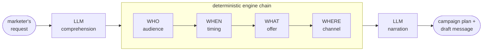

# ORBIT — agentic marketing planning

**Hyundai Card internship, summer 2026**

There's no code in this repo. ORBIT was built in a private company repo and the source
belongs to Hyundai Card. What I can share is what the system did, the decisions I made
building it, and how I tested them.

---

## The problem

A marketer at a card issuer wants to run a campaign. They can describe it in a sentence:
*"find our cafe-heavy customers and give them something."* Turning that into a campaign
anyone can deploy means answering four questions:

> **WHO** to target · **WHEN** to reach them · **WHAT** to offer · **WHERE** to send it

Each of those is normally a separate request to a separate analyst, and the round trip
takes weeks. ORBIT was an attempt to collapse it into one conversation.

## How it works



The main design decision: the language model reads the request and writes the summary,
but it doesn't make any of the four decisions. Those are handled by scoring engines
computing against the customer database. Same input, same output, and the reasoning can
be shown as arithmetic instead of trusted because a model said so.

I built it that way because the marketer deploying the plan will ask why this audience,
and "the model picked it" isn't an answer they can take to a budget holder. It also means
two identical requests produce identical plans.

## Decisions I made

**The objective function was rewarding defaults.** The system ranked offers by expected
value, and a lending offer's value was its gross interest income. So the ranking preferred
customers who would borrow the most at the highest rates, which is close to a description
of who defaults. I subtracted expected default loss from the gross. A high-risk borrower's
value now goes negative and the offer suppresses itself. The arithmetic had been correct
the whole time; the objective was wrong.

**Timing predictions were more precise than the data.** Every prediction returned a
specific date. That's useful for a category someone buys weekly and meaningless for one
they buy once a year, but a marketer will act on it either way. I gave predictions a grain
of day, week, or month, and stopped day-level output for categories whose behaviour
couldn't support it. I fixed it in the model rather than rounding the output, so the grain
travels with the number wherever it goes.

**Propensity to uplift.** Ranking customers by probability of conversion spends budget on
people who would have converted anyway. I moved the objective to uplift,
P(convert | treated) − P(convert | control), fit as a two-head model against an untreated
control group, with a randomized holdout arm so real control data keeps accruing after
deployment.

## Testing

I gated the models on recovering known values rather than on accuracy, which doesn't mean
much without a baseline to beat.

The data pipeline plants known coefficients into a synthetic population, generates
behaviour from them, fits the models against that behaviour, and fails unless the fitted
coefficients come back close to the planted ones. Every reseed refits, so the models can't
drift from the data they were fit on.

```
planted vs learned — per-category coefficients
  feature_a      planted +0.65    learned +0.82
  feature_b      planted +0.30    learned +0.30
  feature_c      planted +0.20    learned +0.20
  elasticity     planted +0.80    learned +0.75     recovery: PASS

gate PASS: 22/22 categories
```

A change that breaks the math fails the seed immediately, instead of turning up in a
dashboard three weeks later.

All customer data was synthetic and generated by that pipeline. No production data was
used at any point.

## Scale

|  |  |
|---|---|
| Build window | 2026-06-10 to 2026-07-09 |
| My commits | 253 of 543 non-merge commits across five contributors (~47%), 250 of them inside that window |
| Backend | 22,900 lines of Python |
| Tests | 10,400 lines across 56 files |
| Frontend | 9,400 lines across 5 React apps |
| Documentation | ~9,600 lines, including Korean localization |

Stack: Python, FastAPI, LangGraph, MCP, PostgreSQL, scikit-learn, React + Vite.

## What's not here

The source, Hyundai Card's internal customer-data platform and its tag taxonomy, the actual
terms and weights in the objective function, and the card product lineup. Everything above
is described at a level that doesn't reproduce anything internal.

Ask me if you want more detail on the engineering.
